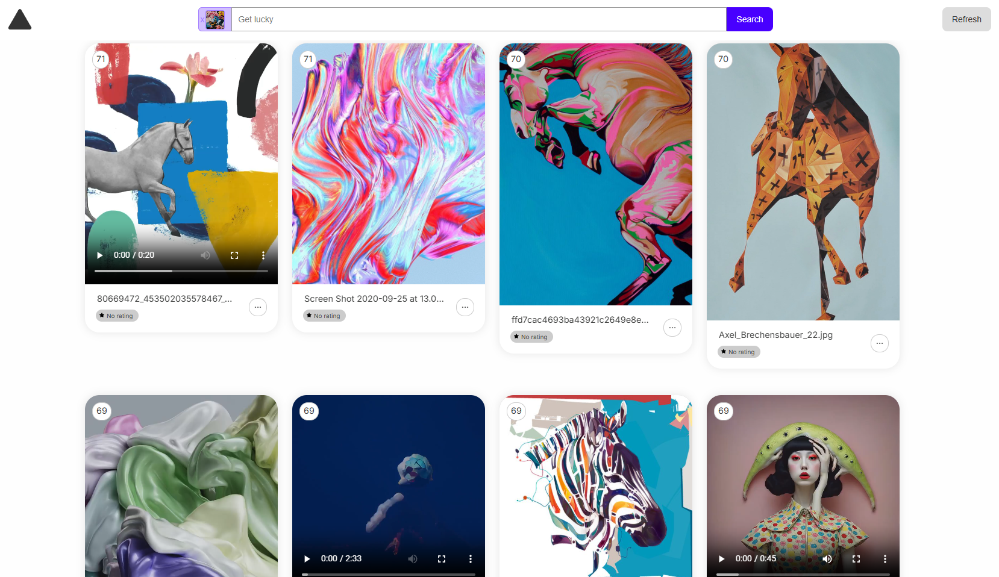

# VibeVault

VibeVault is a local media search app for images, GIFs, and videos. It indexes a folder on your machine, generates visual embeddings, extracts OCR text, and serves a small web UI for searching your media by text or by image.

Search methods:

- **Filename search**: finds fuzzy matches in media filenames.
- **OCR text search**: finds text detected inside images and sampled video frames.
- **Visual semantic search**: finds objects, colors, scenes, styles, composition, and other visual concepts using CLIP embeddings.
- **Search by image**: drag and drop an image to find visually similar media.
- **Video and GIF search**: samples frames from videos/GIFs so moving media can be found through text, OCR, or visual similarity.

## Features

- Semantic image search using CLIP embeddings.
- Search by image: drag an image into the web UI to find visually similar media.
- OCR search for text detected inside images and sampled video frames.
- Video and GIF processing by sampling frames and indexing their visual content.
- Filename matching, OCR matching, and semantic matching are combined into one ranked result list.
- Media rating, description editing, deletion, and refresh/rescan actions from the UI.
- Automatic folder monitoring with a debounce delay, so newly synced files are indexed after changes settle.
- Can point at a local folder, Google Drive folder, Dropbox folder, OneDrive folder, or any other synced directory.
- Can run internally on a LAN or VPN by binding to `0.0.0.0`.
- Can run directly on port `5002`, or behind nginx under a path such as `/sem-search/`.

## Tech Stack

- Backend: Python, Flask, SQLite, Watchdog.
- Search/indexing: SentenceTransformers, CLIP, Faiss.
- OCR: EasyOCR.
- Image/media handling: Pillow, Decord, NumPy.
- Frontend: React, Vite, React Router, Axios, Sass.
- Local storage:
  - `files.db` stores file metadata.
  - `files_e.index` stores Faiss vectors.
  - `files_e.index.mapping.json` may be created for index metadata.

## Models

The app downloads models automatically on first run if they are not already cached.

- Semantic model: `clip-ViT-L-14`, the SentenceTransformers CLIP ViT-L/14 model.
  - Loaded with `SentenceTransformer(model_desc_url, trust_remote_code=True)`.
  - Configured in `config.json` with `model_desc_url`.
- OCR model: EasyOCR English reader
  - Loaded with `easyocr.Reader(['en'], gpu=torch.cuda.is_available())`.

First startup needs internet access unless these models are already cached locally.

## System Requirements

Minimum:

- 64-bit Windows, macOS, or Linux.
- Python 3.10 or newer.
- 8 GB RAM.
- 3 GB to 5 GB free disk space for the app, base dependencies, and initial model cache.
- Internet access for first-time dependency and model downloads.
- CPU-only processing is supported, but initial indexing can be slow.

Recommended:

- 16 GB RAM or more.
- 10 GB+ free disk space if you plan to index a large or video-heavy media library.
- NVIDIA GPU with CUDA support for faster embedding and OCR processing.
- SSD storage for faster scanning, database writes, and Faiss index access.
- A stable LAN/VPN connection if accessing the app from other machines.

For large or video-heavy libraries:

- More RAM and disk space are helpful.
- First indexing can run for a long time because videos are decoded and sampled.
- Keep Google Drive, Dropbox, or similar sync clients fully synced locally before the first scan when possible.

## Disk Space and First Run Time

Actual size and time depend on your OS, Python environment, PyTorch build, internet speed, and whether models are already cached.

Typical expectations:

- Python dependencies: usually a few GB. PyTorch is the largest dependency, especially with CUDA builds.
- `clip-ViT-L-14` model cache: roughly around 1 GB.
- EasyOCR model cache: roughly 100 MB to 300 MB.
- App database and Faiss index:
  - Each indexed vector is 768 float32 values, about 3 KB before Faiss overhead.
  - Images usually add one vector.
  - Videos/GIFs add multiple sampled vectors depending on duration.
  - Large media libraries can grow the index from MBs to GBs.

Download/install time:

- Fast connection: a few minutes.
- Average home connection: 10 to 30 minutes.
- Slow connection or CUDA PyTorch install: longer.

Media processing time:

- Small image folders may finish in minutes.
- Large folders or video-heavy folders can take much longer because videos are decoded, sampled, embedded, and OCR-scanned.
- GPU is faster when available. CPU works, but first indexing can be slow.

## Installation

These steps assume Python 3.10+ and a working terminal.

### 1. Clone the repo

```bash
git clone https://github.com/alextidydx/image-sem-search.git
cd image-sem-search
```

### 2. Create a virtual environment

Windows PowerShell:

```powershell
python -m venv .venv
.\.venv\Scripts\Activate.ps1
```

macOS/Linux:

```bash
python -m venv .venv
source .venv/bin/activate
```

### 3. Install Python dependencies

```bash
pip install -r requirements.txt
```

If you want a specific CUDA-enabled PyTorch build, install PyTorch from the official PyTorch instructions first, then install the rest of the requirements.

### 4. Create `config.json`

`config.json` is local and ignored by git. Start from the sample config:

Windows PowerShell:

```powershell
Copy-Item config.example.json config.json
```

macOS/Linux:

```bash
cp config.example.json config.json
```

### 5. Point the app to your media folder

Edit this value in `config.json`:

```json
"path": "C:/Users/you/Pictures"
```

Examples:

Google Drive on Windows:

```json
"path": "C:/Users/you/My Drive/Media"
```

Dropbox on Windows:

```json
"path": "C:/Users/you/Dropbox/Media"
```

macOS:

```json
"path": "/Users/you/Pictures"
```

Notes:

- Use forward slashes `/` in paths, even on Windows.
- The current app reads `folders[0].path`. Additional folder entries are not indexed yet.
- Files synced by Google Drive or Dropbox are indexed after they appear locally on disk.

### 6. Run the app

```bash
python app.py
```

Open:

```text
http://127.0.0.1:5002/
```

On first run, the app will:

1. Load/download `clip-ViT-L-14`, the SentenceTransformers CLIP ViT-L/14 model.
2. Load/download the EasyOCR model.
3. Create/open `files.db`.
4. Create/open `files_e.index`.
5. Scan your configured folder.
6. Process supported images, GIFs, and videos.
7. Start the Flask web server.

## Running on LAN or VPN

The default config uses:

```json
"host": "0.0.0.0",
"port": 5002
```

That lets other machines on the same LAN/VPN reach the app at:

```text
http://YOUR_MACHINE_IP:5002/
```

You may need to allow Python through your firewall.

Security note: the app does not currently include built-in authentication. Use it on trusted networks, behind VPN, or behind an authenticated reverse proxy. Do not expose it directly to the public internet without adding access control.

## Frontend Development

The built frontend is served from `public/`.

For frontend development:

```bash
cd client
npm install
npm run dev
```

The Vite dev server proxies API calls to the backend on port `5002`.

To rebuild the production frontend:

```bash
cd client
npm run build
```

This writes the built files into `public/`.

## Supported Media

Images:

- `.png`
- `.jpg`
- `.jpeg`
- `.jfif`
- `.webp`

Videos:

- `.avi`
- `.mp4`
- `.mpeg4`
- `.mov`
- `.mkv`

GIF support is handled in code with `.gif`.

## Local Files Created by the App

These files are local runtime data and should not be committed:

- `config.json`
- `files.db`
- `files_e.index`
- `files_e.index.mapping.json`
- `__pycache__/`

They are ignored by the repo `.gitignore`.
